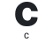

  <picture>
    <source media="(prefers-color-scheme: dark)" srcset="assets/banner-dark.png">
    <source media="(prefers-color-scheme: light)" srcset="assets/banner-light.png">
    
  </picture>

Hi there! I'm Aminul Islam, a CSE undergraduate student at North South University, Dhaka.

I enjoy building clean, useful web tools and exploring AI-powered automation. I'm currently focused on sharpening my skills in **full-stack web development** and turning ideas into practical projects.

- Comfortable with `.c`, `.cpp`, `.java`, `.py`, `.js`, `.ts`, `.php`, `.html`, `.sql`
- Styling with **CSS3, Tailwind CSS, and shadcn/ui**
- Experience with **React, Next.js, Django, Laravel, and MySQL**

> Believer in clean code, thoughtful commits, and steady improvement.

Connect with me: &nbsp;
&nbsp;&nbsp;
&nbsp;&nbsp;
&nbsp;&nbsp;
&nbsp;&nbsp;

## Languages And Tools I Work with

  
  
  
  
  
  
  
  
  
  
  
  
  
  
  
  
  

## Highlights

- **National Champion (2025):** Microsoft Office Specialist in MS Word
- **Campus & Community:** Conducted technical workshops through the NSU ACM Student Chapter R&D group and built utility prototypes for NSU campus systems.

## Featured Projects

Coming soon, In sha Allah.. Check the pins below for now.
