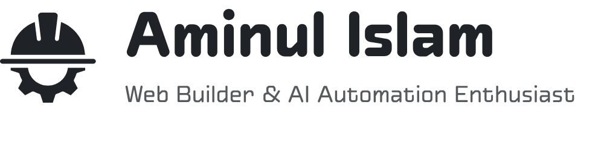
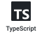
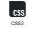

  <picture>
    <source media="(prefers-color-scheme: dark)" srcset="assets/banner-dark.png">
    <source media="(prefers-color-scheme: light)" srcset="assets/banner-light.png">
    
  </picture>

I enjoy building clean, useful web tools and experimenting with AI-powered automation. Currently focused on learning full-stack development and shipping practical projects.

**Find me on:** &nbsp;
&nbsp;&nbsp;&nbsp;
&nbsp;&nbsp;&nbsp;
&nbsp;&nbsp;&nbsp;
&nbsp;&nbsp;&nbsp;

## What I Work With

  
  
  
  
  
  
  
  
  
  
  
  
  
  
  
  

## A Few Highlights

- **National Champion (2025):** Microsoft Office Specialist in MS Word. [certificate ↗](assets/Cert566135815459.pdf)
- **Campus & Community:** Conducted [technical workshops](https://youtube.com/playlist?list=PL0MThPC4xuXrND4UaPDonPhNInpHji_SV) through the NSU ACM Student Chapter R&D group and built [utility prototype](https://github.com/Aminul-Islam7/nsu-wayfinder.git) for NSU campus systems.

## Featured Projects

Check out the pinned repositories below.
