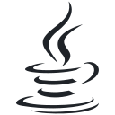

<picture>
  <source media="(prefers-color-scheme: dark)" srcset="assets/banner-dark.png">
  <source media="(prefers-color-scheme: light)" srcset="assets/banner-light.png">
  
</picture>

Hi there! I'm Aminul Islam, a CSE undergraduate student at North South University, Dhaka.

I enjoy building clean, useful web tools and exploring AI-powered automation. I'm currently focused on sharpening my skills in **full-stack web development** and turning ideas into practical projects.

- Comfortable with `.c`, `.cpp`, `.java`, `.py`, `.js`, `.ts`, `.php`, `.html`, `.sql`
- Styling with **CSS3, Tailwind CSS, and shadcn/ui**
- Experience with **React, Next.js, Django, Laravel, and MySQL**

> _believer in clean code, thoughtful commits, and steady improvement._

## Languages And Tools I Work with

  
     
    C
  
  
     
    C++
  
  
     
    Java
  
  
     
    Python
  
  
     
    JavaScript
  
  
     
    TypeScript
  
  
     
    PHP
  
  
     
    HTML5
  
  
     
    CSS3
  
  
     
    Sass
  
  
     
    Tailwind
  
  
     
    shadcn/ui
  
  
     
    React
  
  
     
    Next.js
  
  
     
    Django
  
  
     
    Laravel
  
  
     
    MySQL
  

## Highlights

- **National Champion (2025):** Microsoft Office Specialist in MS Word
- **Campus & Community:** Conducted technical workshops through the NSU ACM Student Chapter R&D group and built utility prototypes for NSU campus systems.

## Featured Projects

Coming soon, In sha Allah.. Check the pins below for now.
